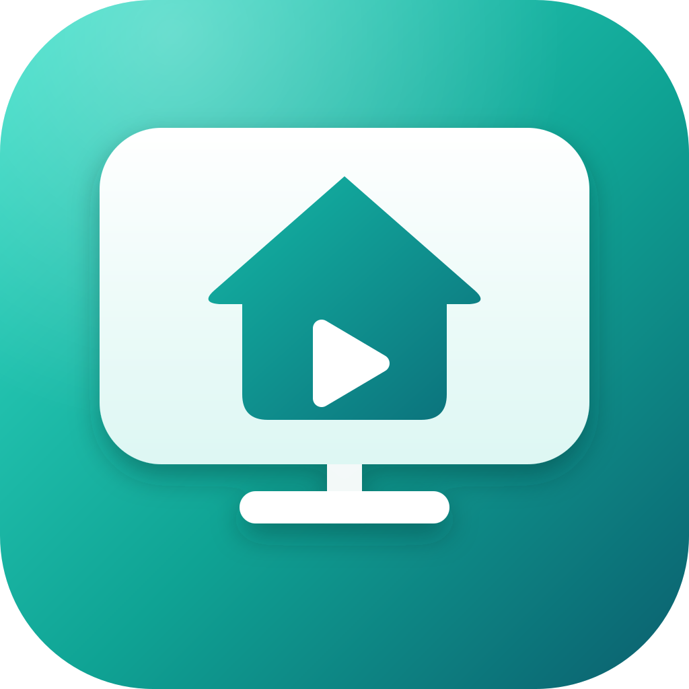
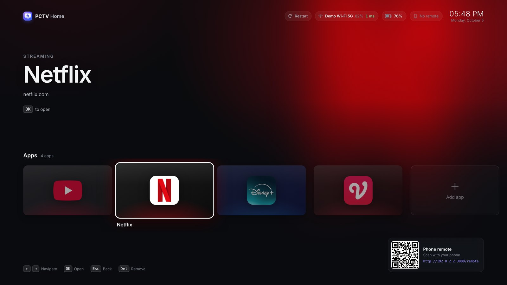
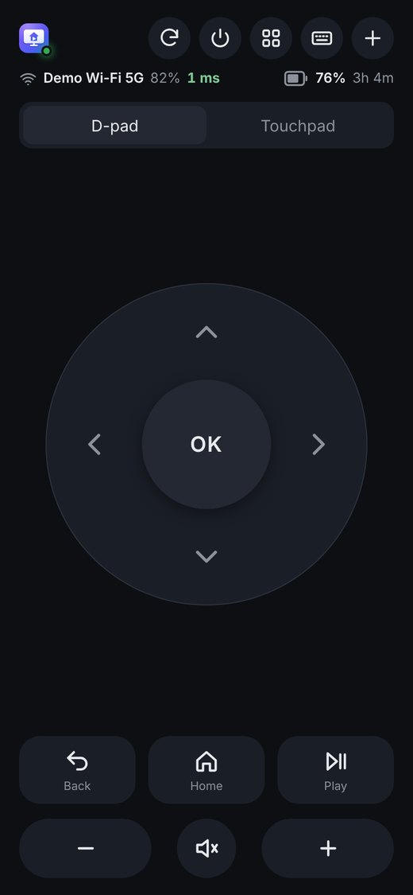
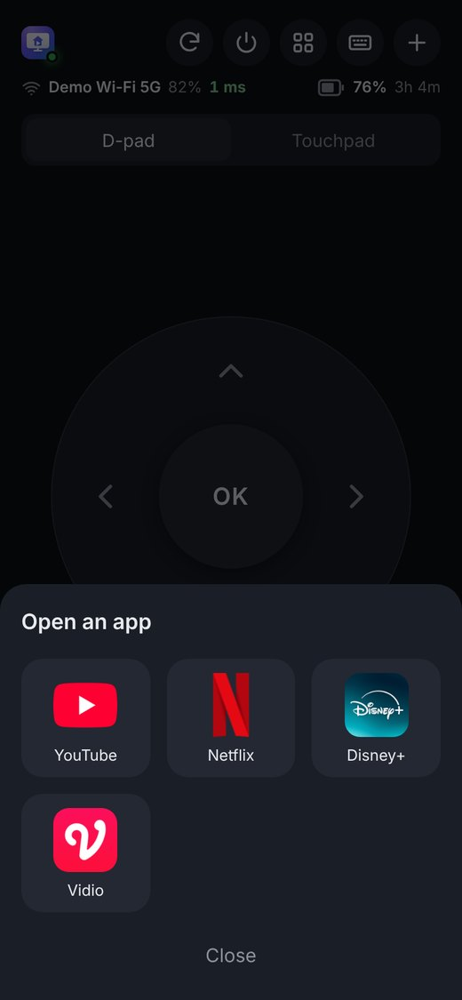
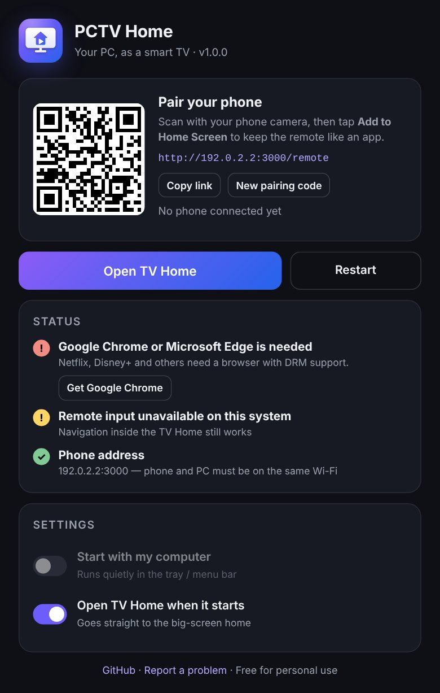

<p align="center">
  
</p>

<h1 align="center">PCTV Home</h1>

<p align="center">
  <b>Turn any Windows PC or Mac into a smart TV.</b><br>
  A big-screen home for YouTube, Netflix, Disney+, Vidio and any website, controlled from your phone.
</p>

<p align="center">
  <a href="https://github.com/fragmentedbin/pctv-home/releases"></a>
  <a href="https://github.com/fragmentedbin/pctv-home/actions/workflows/build.yml"></a>
  
  <a href="LICENSE"></a>
</p>

<p align="center"></p>

## Why

A laptop or mini-PC plugged into a TV is a great media player, until you have to get up and use a mouse. PCTV Home gives it a proper TV interface and turns your phone into the remote. Nothing to install on the phone; it's a web page you add to your home screen.

## Features

- **TV home screen** with your apps as big tiles, real app icons, and a background that follows the app you highlight
- **Phone remote** (iPhone and Android): D-pad, OK, Back, Home, play/pause, volume, mute, a touchpad, and a keyboard
- **Keyboard pops up by itself** when a text field is selected on the TV (email, password, search), and one-time-code fields get your phone's SMS code suggestion
- **D-pad works on normal websites** such as Netflix, Disney+ and Vidio: a focus ring, real hover previews, and row scrolling
- **YouTube's TV interface** (youtube.com/tv) in full screen
- **Add any website** as a tile, from the TV or from your phone
- **PC status on both screens**: battery, Wi-Fi name, signal, and ping
- **Power controls**: reload the page, restart, sleep, restart or shut down the PC from your phone
- **Runs quietly in the tray or menu bar**, starts with your computer, and works without an internet account

<p align="center">
  
  &nbsp;
  
  &nbsp;
  
</p>

## Install

### Windows 10 / 11

| | |
|---|---|
| **Microsoft Store** *(recommended)* | Coming soon. Store apps are signed by Microsoft, so they install even with **Smart App Control** on. |
| **Installer (.exe)** | Download `PCTV-Home-…-win-x64.exe` (or `arm64`) from [Releases](https://github.com/fragmentedbin/pctv-home/releases). |

The installer isn't code-signed yet, so Windows warns about it:

- **SmartScreen** says *"Windows protected your PC"*. Click **More info → Run anyway**.
- **Smart App Control** blocks unsigned apps completely. Use the Microsoft Store version, or install from source (below).

The installer adds a Windows Firewall rule so your phone can connect on **private** (home) networks.

### macOS 12+ (Apple Silicon and Intel)

1. Download `PCTV-Home-…-mac-arm64.dmg` (Apple Silicon) or `…-mac-x64.dmg` (Intel) from [Releases](https://github.com/fragmentedbin/pctv-home/releases) and drag the app to **Applications**.
2. The app isn't notarized by Apple, so the first launch is blocked. Open **System Settings → Privacy & Security** and click **Open Anyway** next to PCTV Home.
3. Allow **Accessibility** when asked. That lets the phone remote press keys and move the pointer.

### You also need

- **Google Chrome** or **Microsoft Edge**. Streaming services need a browser with DRM (Widevine), so PCTV Home plays them in a full-screen Chrome or Edge window. Edge is already on every Windows PC.
- Your **phone and computer on the same Wi-Fi**.

## Getting started

1. Open **PCTV Home**. The control panel shows a QR code.
2. Scan it with your phone camera. The remote opens in the browser.
3. Tap **Share → Add to Home Screen** (iPhone) or **⋮ → Add to Home screen** (Android) to keep it like an app.
4. Press **Open TV Home** in the panel, or on your phone, and pick an app.

The first time you open each service, sign in on the TV. Your logins are kept.

| Remote | Does |
|---|---|
| D-pad / OK | Move and select (hold to repeat) |
| Back / Home | Go back · return to the home screen |
| ▶❚❚ · − 🔇 + | Play/pause · volume |
| Touchpad | Drag = move, tap = click, two-finger tap = right-click, two-finger drag = scroll |
| ⌨ | Type on the TV (pops up automatically on text fields) |
| ▦ | Open an app straight from the phone |
| ↻ · ⏻ | Restart PCTV Home · power menu (sleep, restart, shut down) |

## Troubleshooting

<details><summary><b>My phone can't connect</b></summary>

- The phone and the computer must be on the same Wi-Fi. Guest networks often block devices from talking to each other ("client isolation").
- **Windows:** the Wi-Fi must be set to **Private**: *Settings → Network & internet → Wi-Fi → your network → Private network*. If you said no to the firewall prompt, run this in an admin terminal:
  `netsh advfirewall firewall add rule name="PCTV Home" dir=in action=allow program="C:\Program Files\PCTV Home\PCTV Home.exe" profile=private`
- **macOS:** allow incoming connections for PCTV Home if macOS asks.
</details>

<details><summary><b>The arrows do nothing on the Mac</b></summary>

Give PCTV Home Accessibility access: *System Settings → Privacy & Security → Accessibility*, turn on PCTV Home, then restart it from the menu bar icon.
</details>

<details><summary><b>Apps look tiny on my TV or monitor</b></summary>

Websites are made for a desk, not a couch. **TV size** in the control panel is set to **Auto** by default. It scales the kiosk so pages look the same size on any screen (150% on a 1080p TV, 300% on 4K), and it adjusts automatically when you plug in or unplug a monitor. The kiosk reopens on the home screen when that happens. You can also pick a fixed size (100–300%).
</details>

<details><summary><b>I have two screens and TV Home is on the wrong one</b></summary>

With two or more displays connected, a **Screen** button appears in the top bar of TV Home (press Up from the apps row). Pick the TV or monitor and TV Home restarts there. The choice is remembered. You can also choose it in the control panel or in the phone remote's ⏻ menu.
</details>

<details><summary><b>Netflix quality is low</b></summary>

On Windows, Netflix in Chrome is limited to 720p; Edge supports 1080p and 4K. In the control panel, set **Browser for streaming** to **Microsoft Edge**.
</details>

<details><summary><b>No Wi-Fi name or signal shown</b></summary>

Windows 11 24H2+ and macOS 14.4+ only share Wi-Fi details with apps when **Location** is turned on. Ping and battery still work without it.
</details>

## How it works

```
Phone (web remote) ──Wi-Fi──▶ PCTV Home app (tray / menu bar)
                               ├─ local web server: TV home screen + remote + pairing
                               ├─ native input: Windows SendInput / macOS CGEvent
                               └─ Chrome/Edge in kiosk mode, driven over DevTools (localhost only)
                                   └─ YouTube TV, Netflix, Disney+, any site…
```

Everything stays on your network. There's no account, no cloud and no tracking. A random pairing key in the QR code keeps other devices on the network from controlling your PC; make a new one in the control panel at any time.

## Development

```bash
git clone https://github.com/fragmentedbin/pctv-home.git
cd pctv-home
npm install
npm run dev            # desktop app; restarts / reloads when you edit files
npm run server:kiosk   # headless server + kiosk browser, no Electron
npm test
```

Building installers (CI does this on every `v*` tag, see [`.github/workflows/build.yml`](.github/workflows/build.yml)):

```bash
npm run dist:win     # Windows .exe (NSIS)
npm run dist:store   # Microsoft Store package
npm run dist:mac     # macOS .dmg (ad-hoc signed)
```

The project layout, publishing steps and the Microsoft Store guide are in [docs/PUBLISHING.md](docs/PUBLISHING.md). Contributions are welcome; please read [CONTRIBUTING.md](CONTRIBUTING.md).

## Credits

YouTube TV quality and identity fixes are adapted from [VacuumTube](https://github.com/shy1132/VacuumTube) (MIT). See [THIRD_PARTY_NOTICES.md](THIRD_PARTY_NOTICES.md).

## License

PCTV Home is **free for personal and other noncommercial use** under the [PolyForm Noncommercial License 1.0.0](LICENSE).

**Commercial use** (selling it, bundling it with a product or service, using it in a business, digital signage, hotels…) needs a commercial license. Contact **Muhammad Maududy**: [muhammadmaududy4@gmail.com](mailto:muhammadmaududy4@gmail.com).

---

<sub>YouTube, Netflix, Disney+, Vidio and other names are trademarks of their owners. PCTV Home isn't affiliated with or endorsed by them. App icons are loaded from each service's own website on your computer.</sub>
